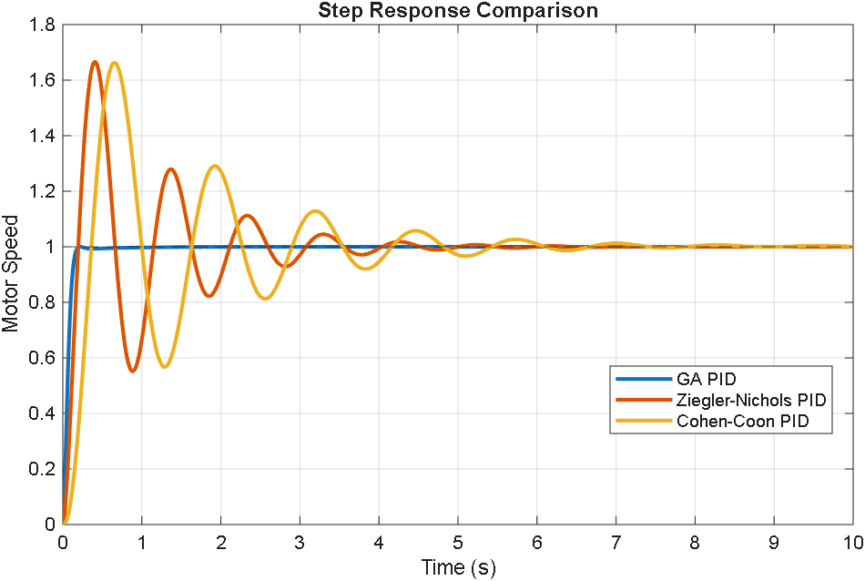
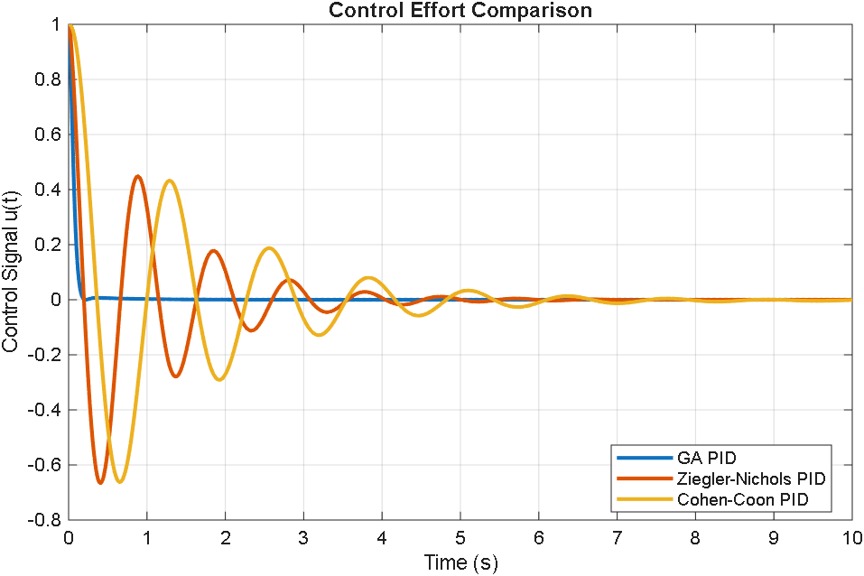
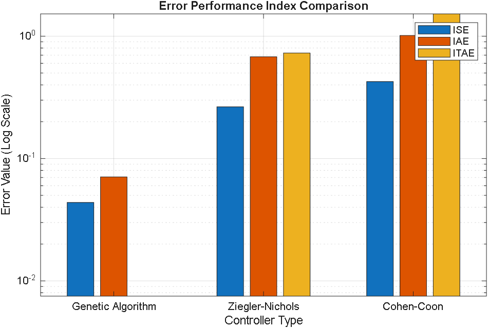
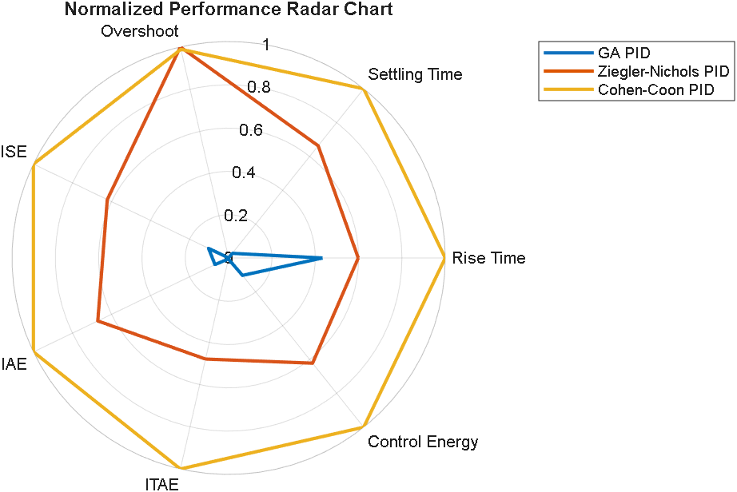

---

# DC Motor PID Controller Tuning and Comparative Analysis

<p align="center">
  Comparative study of classical and optimization-based PID tuning methods for DC motor speed control.
</p>

---

# Overview

This project presents a **comparative analysis of three PID controller tuning techniques** applied to a DC motor system:

* **Genetic Algorithm (GA) Optimization**
* **Ziegler–Nichols (ZN) Classical Tuning**
* **Cohen–Coon (CC) Classical Tuning**

The controllers are evaluated using:

* Time-domain response characteristics
* Error performance indices
* Control effort analysis
* Energy consumption

The goal is to determine which tuning method produces the **most efficient and stable control performance**.

---

# System Modeling

A DC motor converts electrical energy into rotational mechanical motion.
The system dynamics can be described using electrical and mechanical equations.

### Electrical dynamics

[
V_a(t) = L\frac{di(t)}{dt} + Ri(t) + K_b\omega(t)
]

Where:

| Parameter | Description         |
| --------- | ------------------- |
| (V_a)     | Armature voltage    |
| (i)       | Armature current    |
| (R)       | Armature resistance |
| (L)       | Armature inductance |
| (K_b)     | Back EMF constant   |

---

### Mechanical dynamics

[
J\frac{d\omega(t)}{dt} + b\omega(t) = K_t i(t) - T_L
]

Where:

| Parameter | Description          |
| --------- | -------------------- |
| (J)       | Rotor inertia        |
| (b)       | Friction coefficient |
| (K_t)     | Torque constant      |
| (T_L)     | Load torque          |

---

# Transfer Function Model

Combining the electrical and mechanical equations produces the DC motor transfer function:

[
G(s) = \frac{44.99}{s^3 + 44.98s^2 + 78.962s}
]

Where:

| Variable | Description             |
| -------- | ----------------------- |
| (G(s))   | Motor transfer function |
| Input    | Armature voltage        |
| Output   | Angular velocity        |

---

# PID Controller

A **Proportional–Integral–Derivative (PID)** controller is used to regulate the motor speed.

[
C(s) = K_p + \frac{K_i}{s} + K_d s
]

Where:

| Parameter | Function                      |
| --------- | ----------------------------- |
| (K_p)     | Reduces rise time             |
| (K_i)     | Eliminates steady-state error |
| (K_d)     | Improves system damping       |

The tuning process determines the optimal values of (K_p), (K_i), and (K_d).

---

# Controller Tuning Methods

## Genetic Algorithm (GA)

Genetic Algorithms are **evolutionary optimization methods** inspired by natural selection.

The algorithm evolves controller parameters by minimizing the **Integral of Time-weighted Absolute Error (ITAE)**:

[
ITAE = \int_0^T t |e(t)| dt
]

Advantages of GA tuning:

* Global optimization capability
* No need for plant simplification
* Superior performance for complex systems

---

## Ziegler–Nichols Tuning

The Ziegler–Nichols method determines controller parameters based on the **ultimate gain (K_u)** and **oscillation period (P_u)**.

[
K_p = 0.6K_u
]

[
T_i = \frac{P_u}{2}
]

[
T_d = \frac{P_u}{8}
]

Although easy to implement, the method often produces **aggressive controllers with high overshoot**.

---

## Cohen–Coon Tuning

The Cohen–Coon method uses **process reaction curve parameters**:

[
K_p = \frac{\tau/L + 0.333}{K}
]

[
T_i = \tau \left(\frac{30 + 3(L/\tau)}{9 + 20(L/\tau)}\right)
]

[
T_d = \tau \left(\frac{L/\tau}{11 + 2(L/\tau)}\right)
]

This method provides improved damping compared to ZN but still relies on **plant approximation**.

---

# Controller Parameters

| Tuning Method     | (K_p)   | (K_i)    | (K_d)  |
| ----------------- | ------- | -------- | ------ |
| Genetic Algorithm | 24.799  | 0.000    | 15.005 |
| Ziegler–Nichols   | 47.400  | 135.4286 | 4.1475 |
| Cohen–Coon        | 24.2333 | 1.1385   | 0.1100 |

---

# Performance Metrics

The controllers are evaluated using standard time-domain metrics.

| Metric        | Description                           |
| ------------- | ------------------------------------- |
| Rise Time     | Time to reach 90% of final value      |
| Settling Time | Time to remain within 2% tolerance    |
| Overshoot     | Maximum peak relative to steady state |

---

# Error Performance Indices

## Integral of Squared Error

[
ISE = \int_0^T e(t)^2 dt
]

## Integral of Absolute Error

[
IAE = \int_0^T |e(t)| dt
]

## Integral of Time Weighted Absolute Error

[
ITAE = \int_0^T t |e(t)| dt
]

ITAE penalizes **long-duration errors**, making it suitable for optimization-based tuning.

---

# Control Effort

The control signal applied to the system is:

[
u(t) = r(t) - y(t)
]

Control energy is computed as:

[
J_u = \int_0^T u(t)^2 dt
]

This metric indicates how much **energy the controller requires**.

---

# Step Response Comparison

<p align="center">

</p>

### Observations

| Controller        | Behaviour                            |
| ----------------- | ------------------------------------ |
| Genetic Algorithm | Fast response with minimal overshoot |
| Ziegler–Nichols   | Oscillatory behaviour                |
| Cohen–Coon        | Moderate oscillations                |

---

# Control Effort Comparison

<p align="center">

</p>

The GA controller requires **less control effort**, indicating efficient actuation.

---

# Error Performance Comparison

<p align="center">

</p>

GA tuning produces the **lowest tracking error values**.

---

# Radar Chart Performance Comparison

<p align="center">

</p>

The radar chart summarizes normalized controller performance across all metrics.

---

# Quantitative Performance Comparison

| Controller        | Rise Time (s) | Settling Time (s) | Overshoot (%) | ISE    | IAE    | ITAE   | Control Energy |
| ----------------- | ------------- | ----------------- | ------------- | ------ | ------ | ------ | -------------- |
| Genetic Algorithm | 0.10          | 0.16              | 0.00          | 0.31   | 0.24   | 0.05   | 0.12           |
| Ziegler–Nichols   | 0.14          | 3.90              | 66.49         | 8.10e7 | 1.52e4 | 2.34e4 | 4.21           |
| Cohen–Coon        | 0.23          | 5.88              | 65.74         | 4.51e3 | 3.21e2 | 8.12e2 | 1.73           |

---

# Project Structure

```
DC_motor_PID_tuning
│
├── Scripts
│   ├── DC_motor_Tuning_comparison.m
│   ├── DC_tuned_GA_script.m
│   ├── DC_Tuned_ZN_Script.m
│   ├── DC_Tuned_Coon_Script.m
│   └── GA_fitness_function.m
│
├── figures
│   ├── tuning_step_response_comparison.png
│   ├── tuning_control_effort_plot.png
│   ├── tuning_error_performance_index.png
│   └── tuning_normalized_controller_performance_radar_chart.png
│
└── DCMotorModel.slx
```

---

# Tools Used

* MATLAB
* Control System Toolbox
* Genetic Algorithm Optimization

---

# Conclusion

The comparative analysis shows that:

* **Genetic Algorithm tuning produces the best overall controller performance.**
* Classical tuning methods produce higher overshoot and longer settling times.
* Optimization-based methods are better suited for **higher-order dynamic systems**.

The GA-based controller achieves **superior tracking accuracy, stability, and energy efficiency**.

---

# License

This project is released under the MIT License.

---
